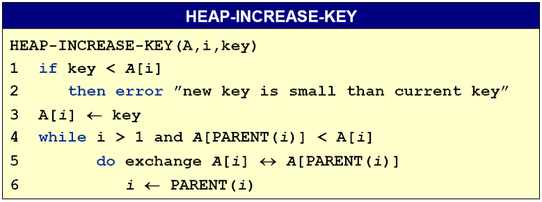
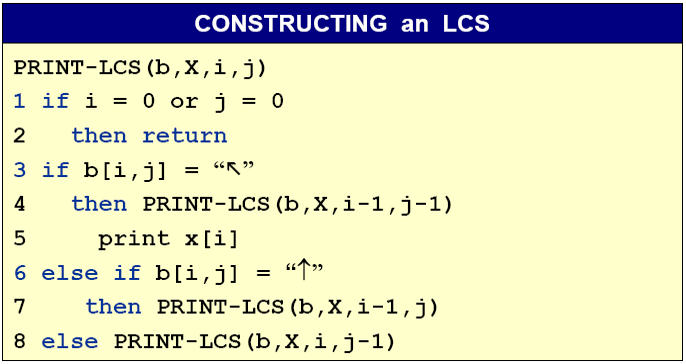

# 0、前言

​	该文档总结了西安电子科技大学软件工程专业专业核心课**算法分析与设计**至少90%的考试重点，适用于对课程有初步了解的同学复习时使用，零基础的同学使用时首先要了解文档中提到的各种概念，每个算法对应的问题。

​	文档分为零散知识点和经典算法两部分，对于零散知识点需要掌握并记忆，对于经典算法需要了解每个算法的步骤，能够使用相应的算法人工求解问题。动态规划问题的递推表达式需要掌握并记忆，伪代码供同学们了解相应算法的思想，考试不要求写代码或伪代码。

​	对知识点复习后可利用往年题检验复习成果。

​	试卷结构如下图：

# 1、零散知识点

## 1.1、递归树计算

- 画递归树：需标明树高、树根和每层的开销。其中树高为log~b~n，树根为f(n)，每层的开销根据题目所给信息得到，最后一层的开销为$n^{log_ba}T(1)$ 

- 计算：通常利用等比数列求和公式计算递归式的时间复杂度

- 证明：通常利用第二数学归纳法证明上一步计算得到的结果。一般假设T(n/2)成立，证明T(n)成立，有时需要减去一个低阶项

  例题：

  Use a recursion tree to determine a good asymptotic upper bond on the recurrence T(n)=4T(n/3)+n. Use the substitution to verify your answer

  

$T(n)$ = [1 + $\frac{4}{3}$ + $(\frac{4}{3})^2$ + --- + $(\frac{4}{3})^{\log_3n -1}$ ] $n$ + $n^{log_34}T(1)$ 

​		=$O(n^{log_34})$

若证$T(n)\leq{n^{log_34}}$ , 即证$T(n)\leq{cn^{log_34} - bn}$ 

不妨设$T(\frac{n}{3})\leq{c(\frac{n}{3})^{log_34}-\frac{bn}{3})}$ 

$T(n)\leq{4c(\frac{n}{3})^{log_34} - \frac{4bn}{3} + n} = c{n^{log_34}} - \frac{(4b-3)}{3}n$ 

上式当$c\geq3$ 时成立

## 1.2、主定理

- CASE 1:$ \begin{aligned}
  &f(n)=O\left(n^{\log _{b} a-\varepsilon}\right), \quad \varepsilon>0, \quad T(n)=\theta\left(n^{\log _{b} a}\right) 
  \end{aligned}$ 
- CASE 2:$\begin{aligned}
  &f(n)=O\left(n^{\log _{b} a} \lg ^{k} n\right), \quad k \geqslant 0, \quad T(n)=\theta\left(n^{\log _{2} a} \lg ^{k+1} n\right)
  \end{aligned}$
- CASE 3:$\begin{aligned}
  &f(n)=\Omega\left(n^{\log _{b} a+\varepsilon}\right), \quad \varepsilon>0, \quad T(n)=\theta(f(n))
  \end{aligned}$

## 1.3、排序算法对比

| Sorting methods | Worst Case | Best Case | Average Case | Stable | Inplace | Application                              |
| --------------- | ---------- | --------- | ------------ | ------ | ------- | ---------------------------------------- |
| Insert Sort     | $n^2$      | $n$       | $n^2$        | T      | T       | Very fast when n<50                      |
| Bubble Sort     | $n^2$      | $n$       | $n^2$        | T      | T       | Very fast when n<50                      |
| Merge Sort      | $nlogn$    | $nlogn$   | $nlogn$      | T      | F       | Need extra space; good for external sort |
| Heap Sort       | $nlogn$    | $n$       | $nlogn$      | F      | T       | Good for real-time app                   |
| Quick Sort      | $n^2$      | $nlogn$   | $nlogn$      | F      | T       | Practical and fast                       |
| Counting Sort   | $k+n$      | $k+n$     | $k+n$        | T      | F       | Small, fixed range;                      |
| Radix Sort      | $d(k+n)$   | $d(k+n)$  | $d(k+n)$     | T      | F       | Fixed range                              |
| Bucket Sort     | $n$        | $n$       | $n$          | T      | F       | Uniform distribution                     |

## 1.4、分治的三个步骤

- 分：将问题分解为若干较小规模的子问题（相互独立，与原问题形式相同）
- 治：递归求解每个子问题
- 合并：将子问题的解合并，得到原问题的解

## 1.5、DP的四个步骤

- 刻画问题的最优子结构
- 递归定义最优解的值（递推式）
- 以自底向上方式求最优解的值
- 使用计算过程中的信息构造最优解

## 1.6、最小代价搜索

​	回溯法通常采用深度优先搜索，分支限界法可采用DFS、BFS、D-search	

​	而最小代价搜索搜索时利用代价评估函数优先选择代价最小的分支，代价评估函数为$c(x) = f(h(x)) + g(x)$，其中$f(x)$为非递减函数，防止深度更深的节点占优势；$h(x)$为从根到节点x的花费；$g(x)$为x到叶子节点的距离。

## 1.7、NPC

- undecidable problems：计算机不能有效解决的问题，例如：Hilbert's 10th problems、Halting problem、 Post's Correspondence Problem
- P：在多项式时间内可以解决的问题
- NP：在多项式时间内可以被证明的问题
- NPC：NP问题中的一个问题，如果它能够被有效解决，则它可以作为1个子程序有效解决NP中其他任何问题。例如：3色问题、TSP等

# 2、经典算法

## 2.1、排序算法

### 2.1.1、插入排序

### 2.1.2、归并排序

​	归并排序中分治法的三个步骤分别为：

- 分：将n个元素分成拥有$\frac{n}{2}$个元素的子序列
- 治：递归排序这两个子序列
- 合：对两个排序后的子序列进行合并并产生排序后的答案

### 2.1.3、堆排序

​	堆排序需要首先构建堆（此处以大顶堆为例），之后调用$n-1$次MAX-HEAPIFY进行排序

​	

​	三个函数的时间复杂度分别为$O(logn)$、$O(n)$、$O(nlogn)$

### 2.1.4、优先队列

​	优先队列严格意义上并不属于排序算法，但由于其与堆排序十分相似，故在此介绍优先级队列的4个操作：MAXIMUM(获取最大值)、HEAP-EXTRACT-MAX(取出最大值)、HEAP-INCREASE-KEY(改变权重)、MAX-HEAP-INSERT(插入数据)

​	其中MAX-HEAP-INSERT借助HEAP-INCREASE-KEY完成	

​	四个函数的时间复杂对分别为$O(1)、O(logn)、O(logn)、O(logn)$ 

###2.1.5、快速排序

​	快速排序的分治步骤分别为：

- 分：将数组围绕$pivot$划分成两部分，使得左子数组元素$<pivot<$右子数组元素
- 治：递归排序子数组
- 合：无

​	由于快速排序最坏时间复杂度为$O(n^2)$，这种情况出现在待排序列已经有序或者待排序列所有元素相等的情况下，为了避免这种情况的发生，可以随机选取$pivot$

### 2.1.6、计数排序

### 2.1.7、基数排序

### 2.1.8、桶排序

​	以上三种排序算法均为线性时间复杂度，利用数据的某种性质而非比较进行排序

## 2.2、分治思想

### 2.2.1最大子数组

​	最大子数组的暴力解法是穷举所有可能，选出最佳的解，时间复杂度为$O(n^2)$

​	可以使用分治的思想进行求解，但由于将数组分为两部分之后最优解并不一定只出现在子问题中，有可能会横跨两个子问题，所以需要考虑最优解横跨两个子问题的情况。

##2.3动态规划思想

### 2.3.1、装配线问题

​	递推表达式为:

​	求最优解的值：

​	求最优解：

### 2.3.2、矩阵链乘

​	递推表达式为：

​	求最优解的值：

​	求最优解：

### 2.3.3、最长公共子序列

​	递推表达式：

​	求最优解的值：

​	求最优解：

​	

### 2.3.4、最大子数组

​	递推表达式：

​	求最优解的值：

​	

### 2.3.5、0/1背包

​	递推表达式：

​	求最优解的值：

## 2.4、贪心思想

### 2.4.1、活动选择问题

​	贪心准则：结束时间最早

### 2.4.2、分数背包

​	贪心准则：性价比最高

## 2.5、最短路径算法

​	**Dijkstra**算法和**Bellman-Ford**算法是单源点最短路径算法，**Floyd**算法和**Johnson**算法是全源最短路径算法

###2.5.1、Dijkstra算法

​	Dijkstra算法利用贪心思想，每次将距离源点最近的点加入$S$中，并以S点为中继更新源点到其他点的距离，即松弛操作。

###2.5.2、Bellman-Ford算法

​	Dijkstra算法无法处理负权值的边，Bellman-Ford算法可以。其思想是遍历每个端点$|V-1|$次，每次对所有的边进行松弛操作。

###2.5.3、**Floyd**算法

​	Floyd算法采用动态规划的思想，其递推表达式为：

​	求最优解的值：

### 2.5.4、Johnson算法

​	Johnson算法同时使用了Bellman-Ford算法和Dijkstra算法，具体步骤如下：

- 首先增加一个到所有点的距离都为0的点$S'$，将其作为源点利用Bellman-Ford算法计算$S'$到各点的距离$h(u)$并记录下来
- 对于边(u, v)，其原始权重为$w(u,v)$,更新其路径的权值为：$w(u,v)+h(u)-h(v)$
- 之后对每个点使用Dijkstra算法计算其单源最短路径
- 最后由于重赋权改变了图中路径的长度，最后需要还原上一步骤中求得最短路径的长度

## 2.6、回溯思想

### 2.6.1、N皇后问题

​	其限界函数为：

​	求解过程为：

