[toc]

# 0、前言

​	本文档适合零基础同学复习使用	

​	机器学习与数据挖掘考试题量较大，有计算题和简答题两部分，本文档主要针对计算题，简答题主要考察各类记忆的知识点，例如LDA与PCA的区别，它们各自的优缺点等，由于这部分重点不突出且知识点过于零散，建议同学们自行翻阅老师课件。

# 1、数据的相似度和相异度

## 1.1、距离

- 欧几里德距离：$d(\boldsymbol{x}, \boldsymbol{y})=\sqrt{\sum_{k=1}^{n}\left(x_{k}-y_{k}\right)^{2}}$
- 闵氏距离：$d(\boldsymbol{x}, \boldsymbol{y})=\left(\sum_{k=1}^{n}\left|x_{k}-y_{k}\right|^{r}\right)^{\frac{1}{r}}$   （欧几里德距离是闵氏距离的一种特例）

## 1.2、相似性

- 简单匹配系数(SMC)：SMC = 值匹配德属性个数/属性个数 = $(f_{11}+f_{00})/(f_{01}+f_{10}+f_{11}+f_{00})$ 

  $f_{01}$为$x$取$0$且$y$取1的属性数，其余同理

- 杰卡德系数(Jaccard Coefficients)：$J=$1-1匹配的特征个数/不涉及0-0匹配的特征个数 = $(f_{11})/(f_{01}+f_{10}+f_{11})$ 

- 余弦相似度：$\cos (\boldsymbol{x}, \boldsymbol{y})=\frac{\langle\boldsymbol{x}, \boldsymbol{y}\rangle}{\|\boldsymbol{x}\|\|\boldsymbol{y}\|}$ ,其中$\langle\boldsymbol{x}, \boldsymbol{y}\rangle$ 表示两向量的内积

- 例题：

  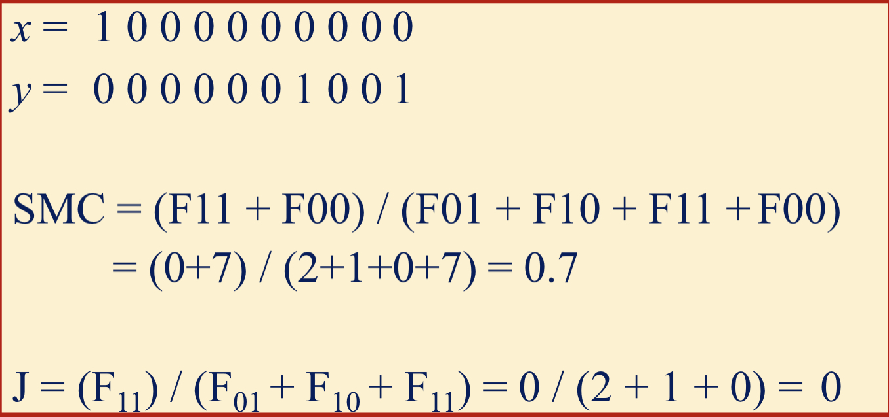

  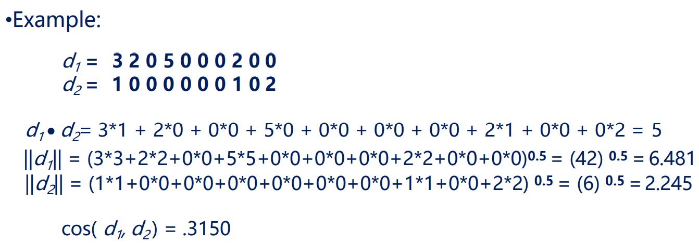

## 1.3、相关性

- 皮尔森相关系数：$\operatorname{corr}(\boldsymbol{x}, \boldsymbol{y})=\frac{\operatorname{covariance}(\boldsymbol{x}, \boldsymbol{y})}{\text { standard_deviation }(\boldsymbol{x}) \times \text { standard_deviation }(\boldsymbol{y})}=\frac{s_{x y}}{s_{x} s_{y}}$ ,即协方差与标准差之比，其中$\operatorname{covariance}(\boldsymbol{x}, \boldsymbol{y})=s_{x y}=\frac{1}{n-1} \sum_{k=1}^{n}\left(x_{k}-\bar{x}\right)\left(y_{k}-\bar{y}\right)$ ,$\text { standard_deviation }(\boldsymbol{x})=s_{x}=\sqrt{\frac{1}{n-1} \sum_{k=1}^{n}\left(x_{k}-\bar{x}\right)^{2}}$ , $y$的标准差同理
- 例题：

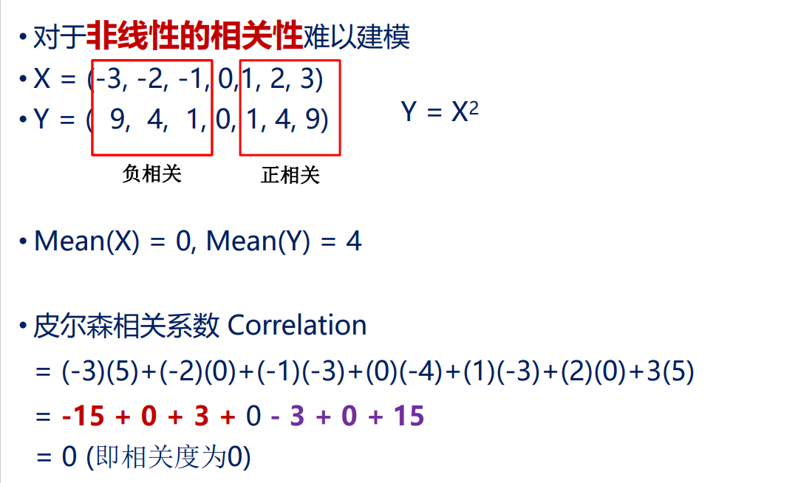

# 2、线性模型

##2.1、向量与矩阵的导数

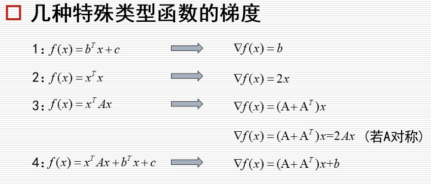

​	对于普通函数的求导见例题：

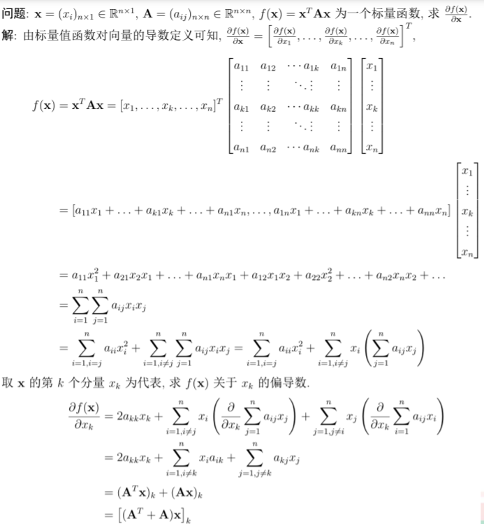

## 2.2、线性判别分析（LDA）

计算步骤如下：

1. 分别计算2个类别的均值$\mu_1和\mu_2$

2. 分别计算2类样本的类内散度矩阵$S_1和S_2$,其中$S_{1}=\frac{1}{n-1}\sum_{x \in \omega_{1}}\left(x-\mu_{1}\right)\left(x-\mu_{1}\right)^{T}$ ,$S_2$同理。

3. 计算总类内散度矩阵$S_w = S_1 + S_2$

4. 计算类间散度矩阵$S_B = (\mu_1 - \mu_2)(\mu_1 - \mu_2)^T$

5. 直接计算$w, w^{*}=S_{W}^{-1}\left(\mu_{1}-\mu_{2}\right)$ 

   或者LDA投影转化为以下广义特征值问题的解：$S_{W}^{-1} S_{B} w=\lambda w$ 

例题：

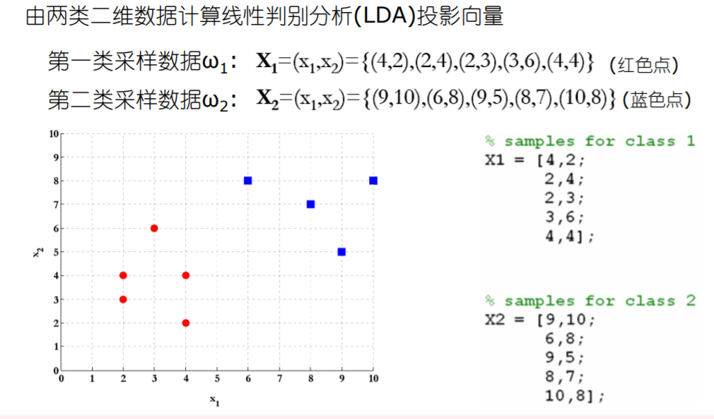

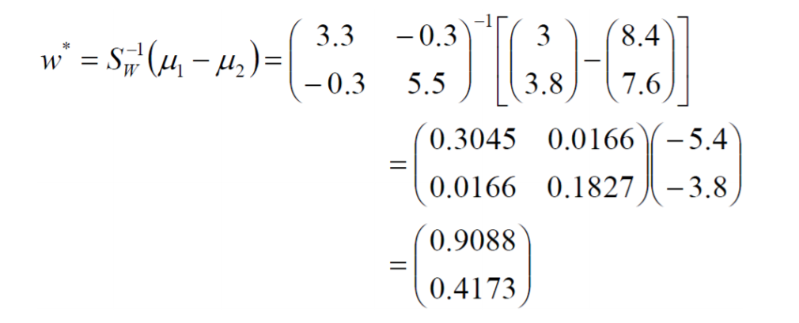

## 2.3、主成分分析（PCA）

计算步骤如下：

1. 对所有样本进行中心化$\boldsymbol{x}^{(i)}=\boldsymbol{x}^{(i)}-\frac{1}{m} \sum_{j=1}^{m} \boldsymbol{x}^{(j)}$ 
2. 计算样本的协方差矩阵$\left(\begin{array}{ll}
   \operatorname{cov}\left(x_{1}, x_{1}\right) & \operatorname{cov}\left(x_{1}, x_{2}\right) \\
   \operatorname{cov}\left(x_{2}, x_{1}\right) & \operatorname{cov}\left(x_{2}, x_{2}\right)
   \end{array}\right)$ , [协方差的计算方法](#1.3、相关性) 
3. 对矩阵进行特征值分解，求出特征值和特征向量，$|A-\lambda E| = 0,\lambda $为特征值 ，$[\lambda_i E - X]x = 0$ ，解该方程组即可得到特征向量
4. 去除最大的n^'^ 个特征值对应的特征向量(n^'^即所需降维后的维数)，将所有的特征向量标准化后，组成特征向量矩阵$W = (w_1; w_2;……w_{n^{`}})^T$   
5. 对样本中的每一个样本 $\boldsymbol{x}^{(i)}$ 转化为新的样本$\text z^{(i)}=W^{T} x^{(i)}$ 
6. 得到输出样本集

# 3、决策树

​	信息熵：$\operatorname{Ent}(D)=-\sum_{k=1}^{|\mathcal{Y}|} p_{k} \log _{2} p_{k}$ 

​	这里D代表当前样本(状态)集合,P代表概率集合,假定当前样本集合D中第k类样本$x_k$所在比例为$p_k,|y|$表示类别个数

	## 3.1、ID3算法

​	决策树每次计算上个节点的信息熵，以及按不同条件进行划分后的信息熵，按信息增益的公式计算后挑选最大增益的划分方法，信息增益代表了在一个条件下，信息复杂度（不确定性）减少的程度.

​	信息增益：$\operatorname{Gain}(D, a)=\operatorname{Ent}(D)-\sum_{v=1}^{V} \frac{\left|D^{v}\right|}{|D|} \operatorname{Ent}\left(D^{v}\right)$ 

​	离散属性$a$有$V$个可能的取值$(a^1,a^2,……a^v)$ ，用$a$来进行划分，则会产生$V$个分支结点，其中第$v$个分支结点包含了$D$中所有在属性$a$上取值为$a^v$的样本,记为$D^v$。则可计算出用属性$a$对样本集进行划分所获得的“信息增益”

​	例：

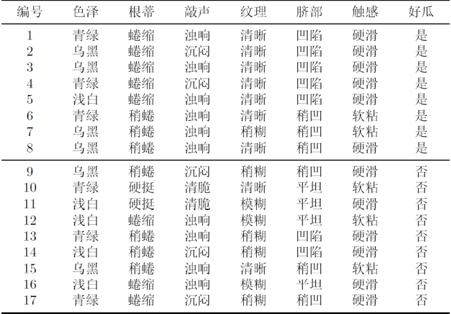

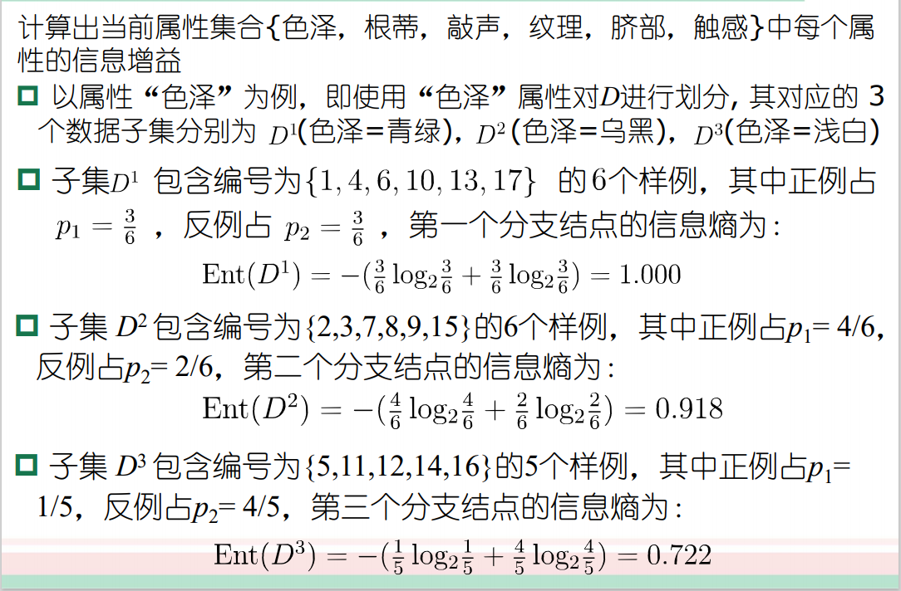

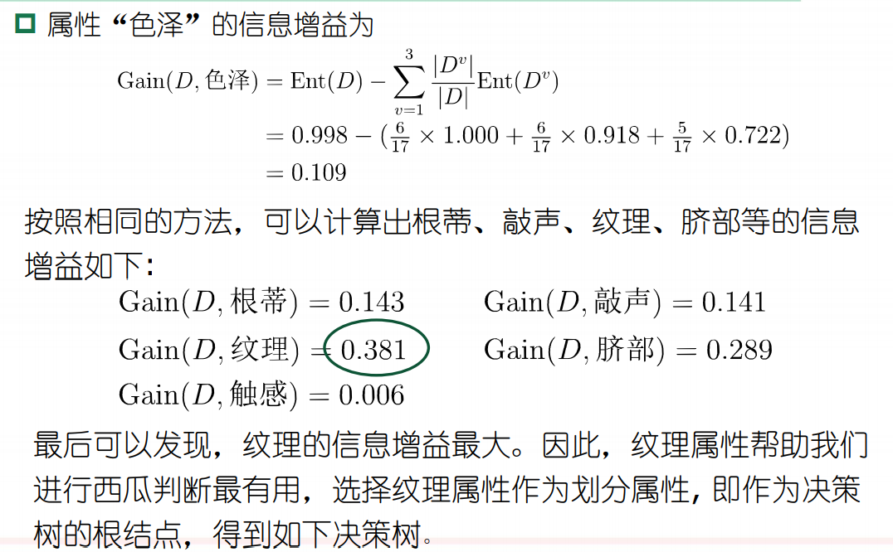

## 3.2、C4.5算法

​	与ID3算法不同之处在于将划分选择依据从信息增益改为增益率，能够避免属性可分类别较多的属性占据优势

​	增益率定义为：$\text { Gain_ratio }(D, a)=\frac{\operatorname{Gain}(D, a)}{\operatorname{IV}(a)}$ ,其中$\mathrm{IV}(a)=-\sum_{v=1}^{V} \frac{\left|D^{v}\right|}{|D|} \log _{2} \frac{\left|D^{v}\right|}{|D|}$ 

## 3.3、CART算法

​	划分选择是基尼指数

​	基尼值定义为：$\operatorname{Gini}(D)=\sum_{k=1}^{|\mathcal{Y}|} \sum_{k^{\prime} \neq k} p_{k} p_{k^{\prime}}=\sum_{k=1}^{|\mathcal{Y}|} p_{k}\left(1-p_{k}\right)=1-\sum_{k=1}^{|\mathcal{Y}|} p_{k}^{2}$ 

​	基尼指数定义为：$\operatorname{Gini_index}(D, a)=\sum_{v=1}^{V} \frac{\left|D^{v}\right|}{|D|} \operatorname{Gini}\left(D^{v}\right)$ 

## 3.4、预剪枝与后剪枝

- 预剪枝：每次划分前计算（此时已选出信息增益最大的属性），若划分后验证集精度未提升则不划分
- 后剪枝：建好决策树后从下到上，从左到右对内部节点判断

## 3.5、连续值与缺失值处理

​	参照老师课件

# 4、神经网络

## 4.1、卷积和互相关

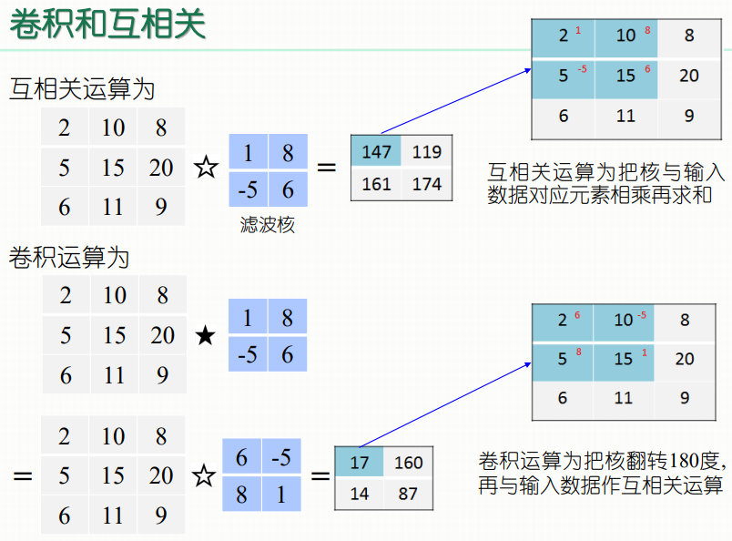

## 4.2、特征图大小

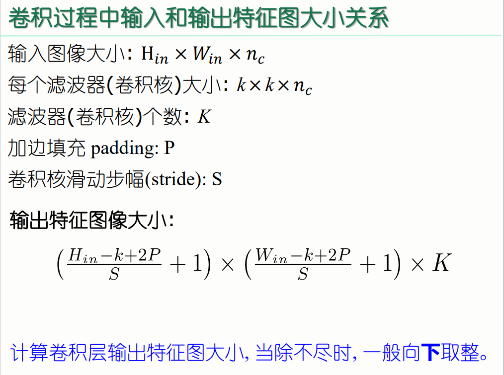

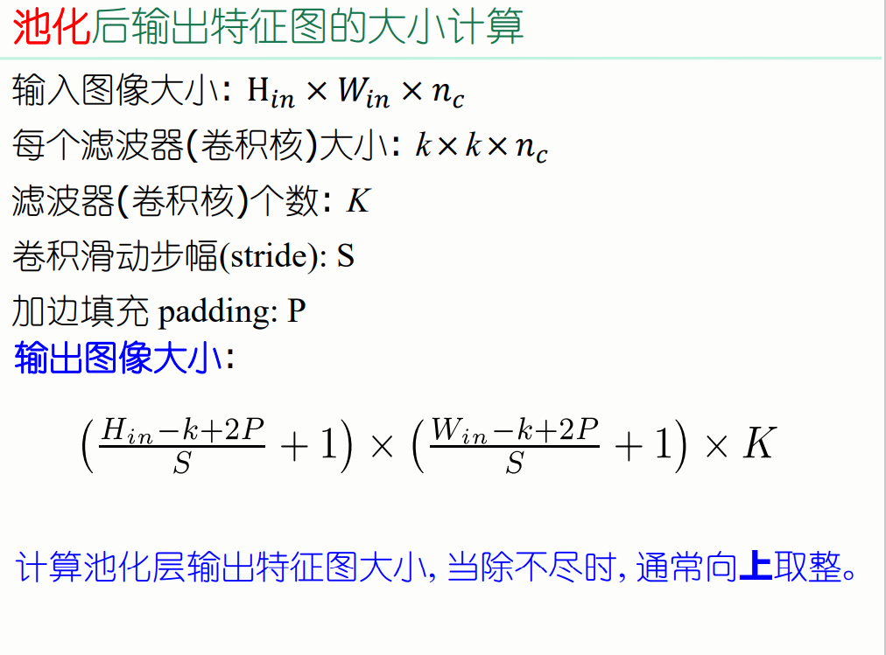

## 4.3、估计计算量

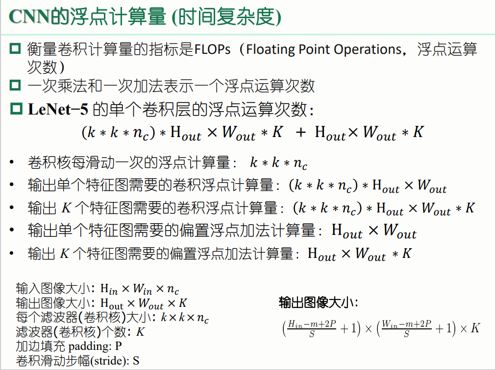

# 5、关联分析

关联规则的度量：

1. 大型数据库可能有百万条规则，因此要限制关联规则数目。规则兴趣度（有效性）的度量：支持度support和置信度confidence。

2. 项集的支持度计数：项集X的支持度计数即频度为数据库中包含项集X的事务数目。

   项集X的支持度sup(X)=X的支持度计数/总事务数。

   规则的支持度：X->Y的支持度为同时包含X和Y的事务数/总事务数

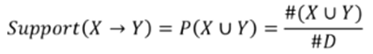

3. 规则的置信度conf：conf(X->Y)= 同时含XY的事务数/含X的事务数

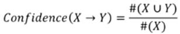

4. 支持度度量了规则在事务数据集中出现的频率，置信度度量规则的强度（规则的可信度）。

   人们只对满足一定条件sup和conf的关联规则感兴趣，因此对两个指标设定阈值。

5. 频繁项集：支持度大于最小支持度minsup的项集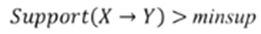

6. 强关联规则：同时满足最小支持度和最小置信度条件的规则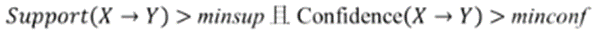

 ## 5.1、关联规则挖掘

​	Apriori算法流程：

1. 产生一个特定大小的项集
2. 扫描数据库一次查看哪些是频繁的
3. 使用频繁项集生成size=size+1的候选项集（只需要找前k-1项相同的项集连接）
4. 迭代找size从1到k的频繁项集
5. 避免生成已知不频繁的候选项集

例：

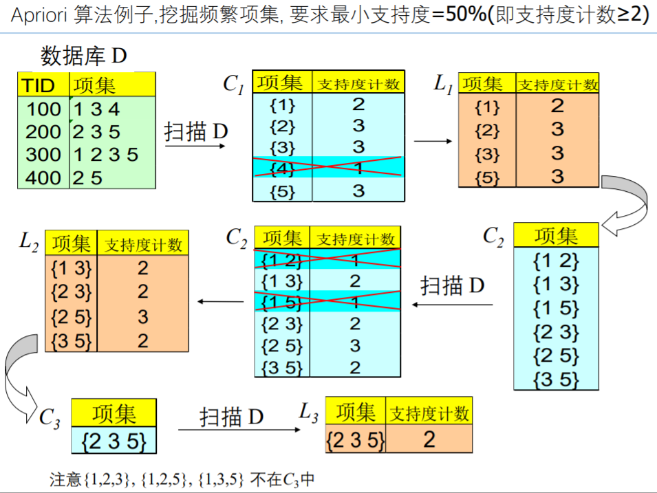

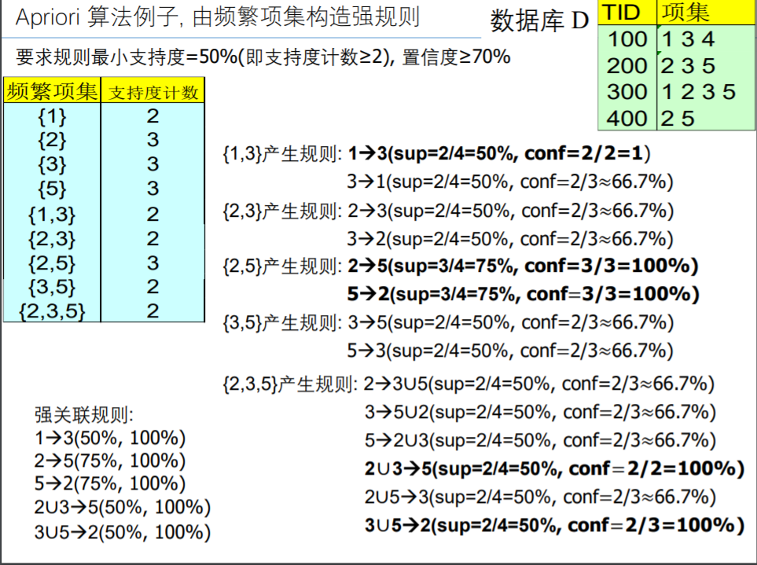

## 5.2、序列模式

​	序列模式是事件之间时间上的相关性，Apriori依然成立，但合并过程：仅当从S^(1)^ 中去掉第一个事件得到的子序列和从S^(2)^ 中去掉最后一个事件得到的子序列相同时合并

​	例：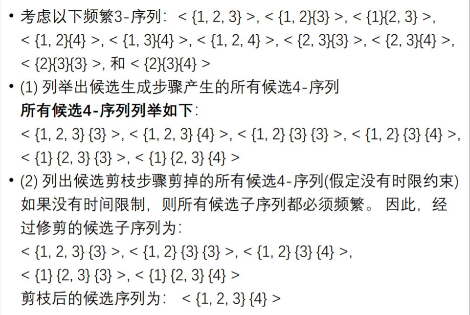

# 6、聚类分析

	## 6.1、K-means聚类

​	误差平方和（SSE）定义为：$\mathrm{SSE}=\sum_{i=1}^{K} \sum_{x \in C_{i}}\left\|x-c_{i}\right\|_{2}^{2}, \quad c_{i}=\frac{1}{n_{i}} \sum_{x \in C_{i}} x$ 

​	SSE是K-means聚类质量评价目标函数

​	K-means算法执行过程为：

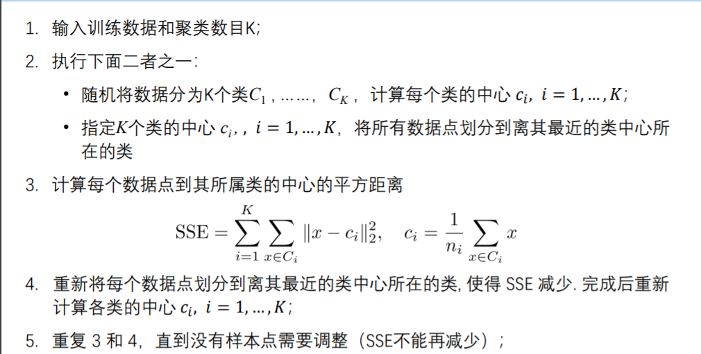

## 6.2、顺序领导者聚类

​	聚类流程：

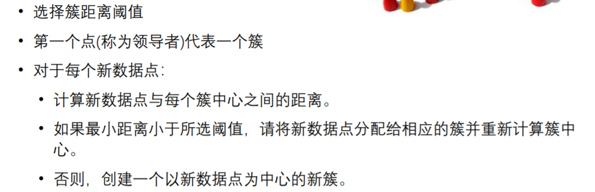

## 6.3、层次聚类

​	层次聚类流程：

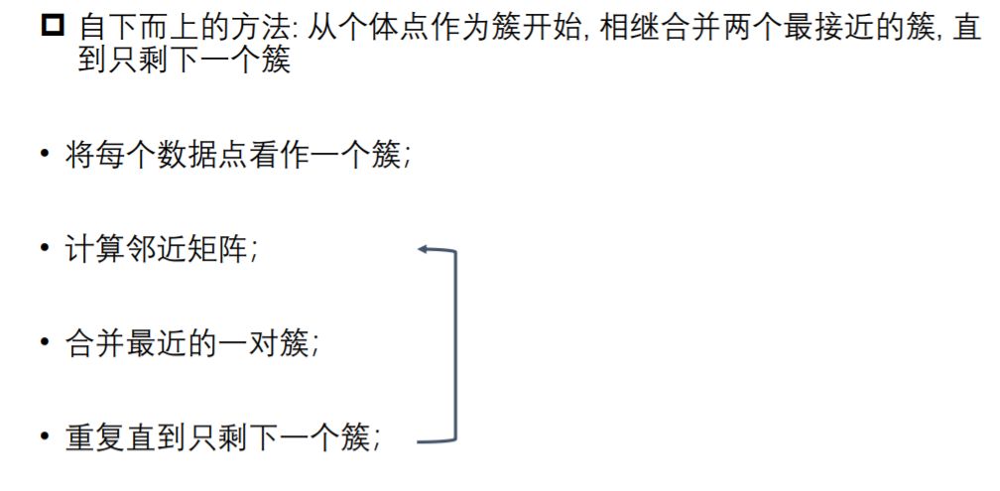

​	

## 6.4、基于密度的方法（DNSCAN）

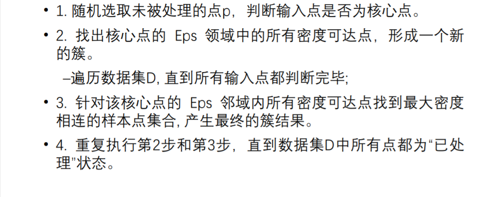

