[toc]

# 0、前言

​	软工的计组只要把老师留的课后题全部掌握分数就不会差，本文档适合对课程知识有一定掌握的同学使用。

​	考试的结构式简答题+计算题+附加题，其中简答题为6道选4道作答，附加题10分，卷面超过100分按100分计算。

​	文档最后是课后习题参考答案，一定要做老师留的课后题！！！

# 1、流水线技术

## 1.1、流水线分类

| 流水线类别 | 定义                                                         |
| ---------- | ------------------------------------------------------------ |
| 静态流水线 | 在同一时间内，流水线的各段只能按同一种功能的连接方式工作     |
| 动态流水线 | 在同一时间内，当某些段正在实现某种运算时，另一些段在实现另一种运算 |

## 1.2、性能分析

### 1.2.1、吞吐率

​	定义：单位时间内流水线所完成的任务数或输出结果的数量

​	最大吞吐率：$TP_{max}=\frac{1}{max \text {{$Δt_i$}}} $ ，若各段相等，$TP_{max} = \frac{1}{Δt_0} $

​	由上式可知消除瓶颈的方法：细分瓶颈段、重复设置瓶颈段

​	实际吞吐率：$TP = \frac{n}{T_{流水}} = \frac{n}{mΔt_0 + (n-1)Δt_0} = \frac{1}{(1+\frac{m-1}{n})Δt_0} = \frac{TP_{max}}{1+\frac{m-1}{n}} $，若各段时间不相等，$TP = \frac{n}{T_{流水}}$

### 1.2.2、 加速比

​	定义：流水线速度与等功能的非流水线速度之比，$S = \frac{T_{非流水}}{T_{流水}}$

​	若各段时间相等，$T_{非流水} = nmΔt_0,T_{流水} = mΔt_0 + (n-1)Δt_0,S = \frac{mn}{m+n-1} = \frac{m}{1+\frac{m-1}{n}}$ 

​	若各段时间不相等，$T_{非流水}=n \sum_{i=1}^{m} \Delta t_{i}, T_{流水}=\sum_{i=1}^{m} \Delta t_{i}+(n-1) \Delta t_{j}, S=\frac{n \sum_{i=1}^{m} \Delta t_{i}}{\sum_{i=1}^{m} \Delta t_{i}+(n-1) \text { $\Delta t_{max}$ }}$   

### 1.2.3、效率

​	定义：通过时间/总时间，$E = \frac{n \Delta t_0}{T_{流水}} = \frac{n}{m+n-1} = \frac{1}{1+\frac{m-1}{n}}$ 

​	三者之间关系，$E = \frac{S}{m}$

## 1.3、相关

​	定义：相邻两条指令存在关联，后一条指令无法再原先指定的时钟周期开始执行

​	

| 类别     | 解释                         |
| -------- | ---------------------------- |
| 结构相关 | 硬件资源冲突                 |
| 数据相关 | 后面的指令需要前面指令的结果 |
| 控制相关 | 会改变PC值和分支指令         |

### 1.3.1、结构相关

​	原因：功能部件不是全流水；重复设置的资源数量不足

​	解决：插入暂停周期；所有的功能单元完全流水化；设置足够多的硬件资源

### 1.3.2、数据相关

​	原因：当指令在流水线中重叠执行时，流水线有可能改变指令读/写操作数的顺序，使之不同于它们在非流水实现时的顺序，三种类型分别为：写后读、写后写、读后写

​	解决：向流水线中加入暂停周期；采用直通技术；增加专用硬件；利用编译器

### 1.3.3、控制相关

​	解决：冻结流水线；预取分支目标；循环缓冲器；分支预测；延迟分支

# 2、存储系统

## 2.1、内存的扩展

​	字扩展：存储单元数的扩展，3-8译码器不同的$\bar Y$ 连接不同的6264数据线和地址信号线公用

​	位扩展：Y~0~公用，地址信号线公用，不同的8264用不同的数据线

## 2.2、地址映射

### 2.2.1、全相联

​	主存的每一块均可装入cache的每一块

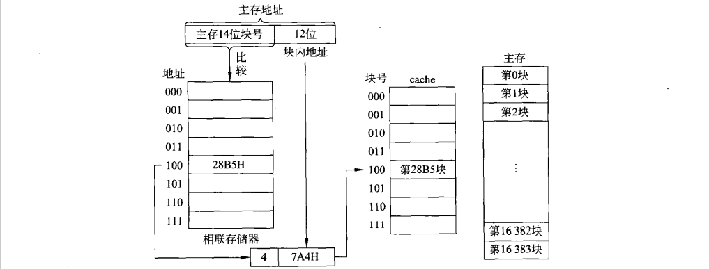

### 2.2.2、直接映射

​	主存先以cache的容量分区，再分块，主存各区块号相同的块只能装入于cache中相同的块号中

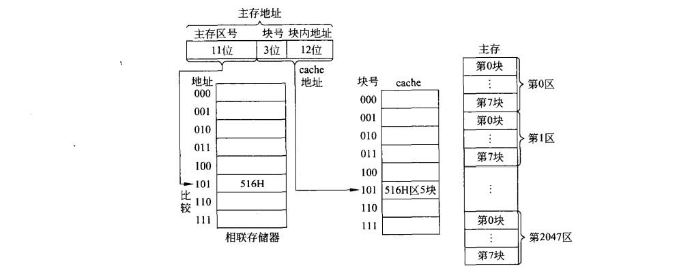

### 2.2.3、组相联方式

​	组间直接，组内全相联（西电软院计组默认如此，还可以是组间全相联，组内直接映射）

​	将cache先分组，组内再分块：主存先以cache容量分区，区内按cache方法分组，组内再分块

​	主存的某号只能装入cache的同号组，组内的块可以装入同组号的任意一块（主存区号+块号在相联存储器中找到它，对应的块号就是cache的块号）

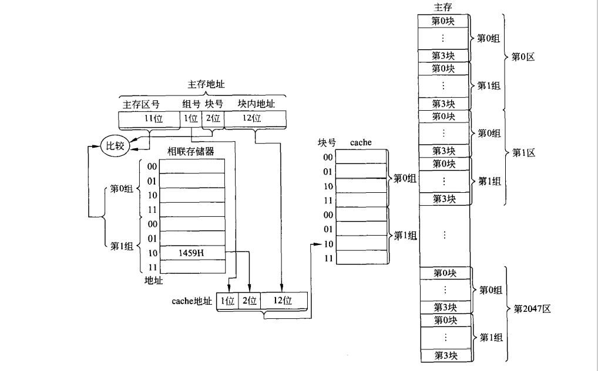

## 2.3、性能分析

​	$S_p = \frac{T_m}{T}$，T~m~为主存访问周期，T为平均访问周期

​	$T = HT_c + (1-H)(T_c + T_x)$，H是命中率，T~c~是cache访问周期，T~x~是块的调入时间或替换开销，T~x~ = nT~m~，其中n代表以n个字或n个字节为一块

# 3、输入输出系统

## 3.1、PCI总线结构特点

- 不依赖处理器
- 每条总线支持256个功能设备
- 支持多达256条PCI总线
- 低功耗
- 支持猝发式事务处理
- 33/66MHz时钟频率
- 32/64位数据总线宽度
- 访问时间: 2时钟周期写，3时钟周期读
- 并发的总线操作
- 支持总线主设备
- 隐藏的总线仲裁:集中式的独立请求仲裁方式
- 低的管脚数目: 49个必备信号，52个可选信号
- 事务处理完整性检验
- 3个地址空间:存储器空间，I/O空间( 64KB,可选择达到4GB)和配置空间
- 自动配置，实现即插即用
- 软件透明
- 具有不同尺寸的插卡、

## 3.2、磁记录方式

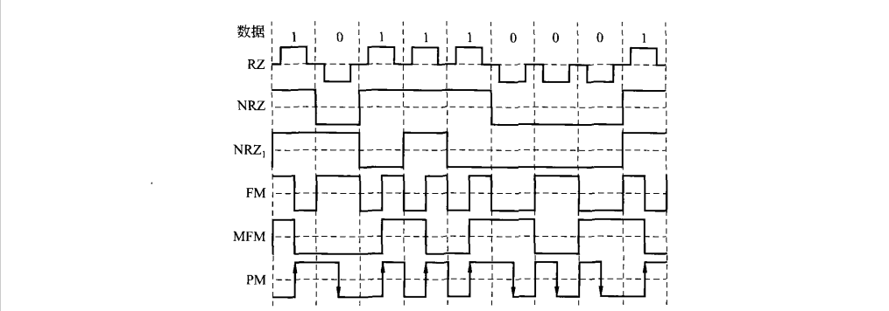

​	

- 归零制(RZ)：0为负、1为正，两位信息之间电流归零
- 不归零制(NRZ)：只有0变1和1变0是电流改变
- 见1就变不归零制(NRZ~1~)：只有记录1时电流改变
- 调频制(FM)：每位改变一次，记录1时中间翻转一次
- 改进调频制(MFM)：记录1时只中间改变一次，记录2个及以上0时每位改变一次
- 调相制(PM)：用不同电流方向表示0或1

​	自同步能力：从单个磁道读出的脉冲序列中提取同步时钟脉冲的难易程度。

​		R=最小磁化翻转间隔/最大磁化翻转间隔(RZ=1、FM=0.5、MFM=0.5、PM=0.5)

​	编码效率：一次此话翻转能记录多少二进制信息。

​		$\eta$ = 位密度/最大磁化翻转密度(FM=0.5、PM=0.5、MFM=1、NRZ=1、NRA~1~=1)

## 3.3磁盘存储器

- 道密度：沿磁盘半径方向单位长度上的磁道数（道/mm）
- 位密度：沿磁道圆周方向单位长度上所能记录的二进制位数(bit/mm)
- 非格式化容量：位密度X内圈磁道周长X磁道总数X记录面数
- 格式化容量：扇区容量X每道扇区数X每个记录面磁道数X记录面数
- 数据传输率：每个扇区的字节数X每道扇区数X磁盘转速

## 3.4外设的编址

- 独立编址
- 统一编址

## 3.5、8255

- 方式0：基本输入输出

- A,B,CH,CL 四个端口可以被分别设置，或输入，或输出，共16种情况

- 无条件数据读写方式实现与外设的交互

控制字：

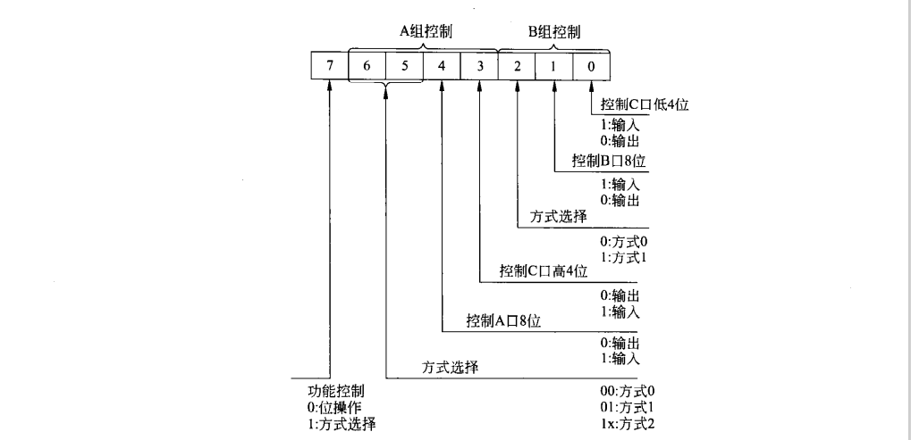

C口的按位操作控制字格式

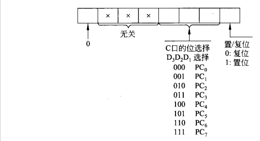

## 3.6、8253

| 方式  | 名字         | 特点                          |
| ----- | ------------ | ----------------------------- |
| 方式0 | 计数结束中断 | 预设的输入输出结束之后中断    |
| 方式1 | 可编程单稳   | 可以循环输出预设的输入        |
| 方式2 | 频率发生器   | 作分频器                      |
| 方式3 | 方波发生器   | 生成方波，占空比为1:1         |
| 方式4 | 软件触发选通 | 与方式0较像，重新写入重新计数 |
| 方式5 | 硬件触发选通 | 与方式4区别为自动重新计数     |

控制字格式：

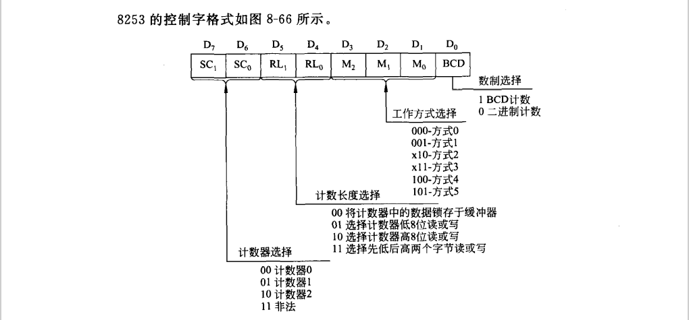

​	初始化流程：写入方式控制字 $\Rightarrow$ 写入计数值低字节 $\Rightarrow$ 写入计数值高字节

# 课后习题参考答案

## 第六章

### 6.5

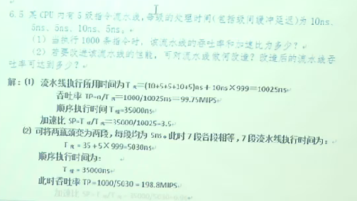

### 6.9

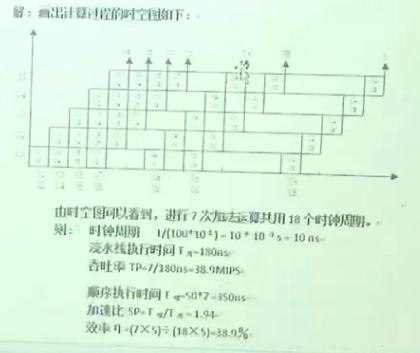

### 6.10

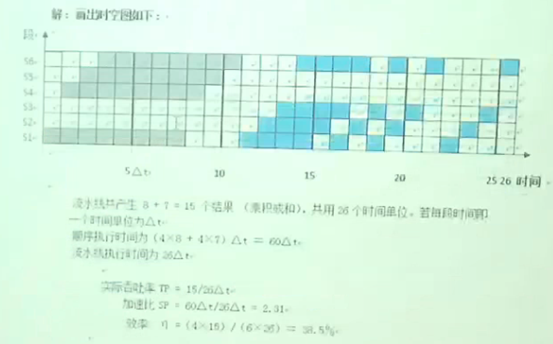

## 第七章

### 7.2

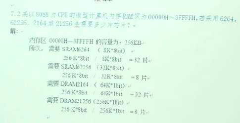

### 7.6

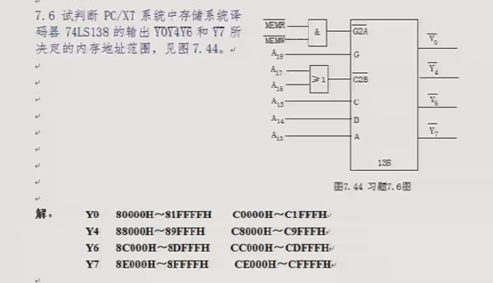

### 7.7

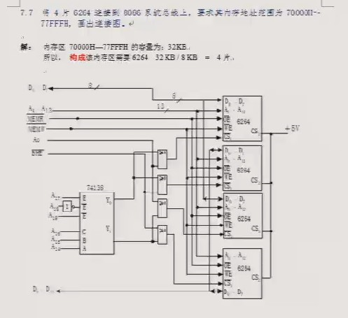

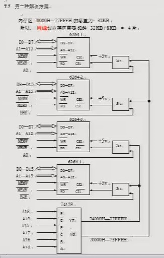

### 7.16

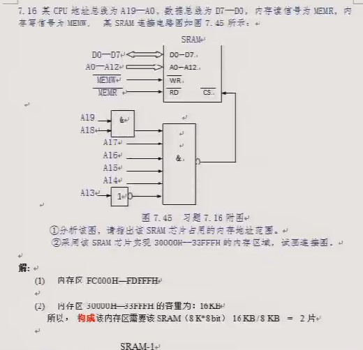

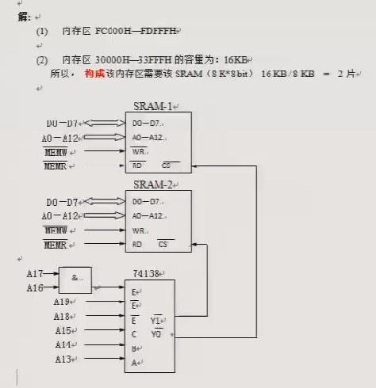

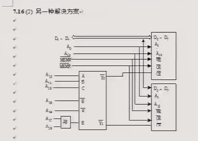

### 7.22

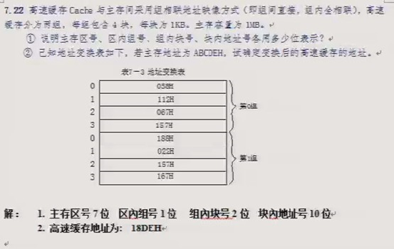

### 7.23

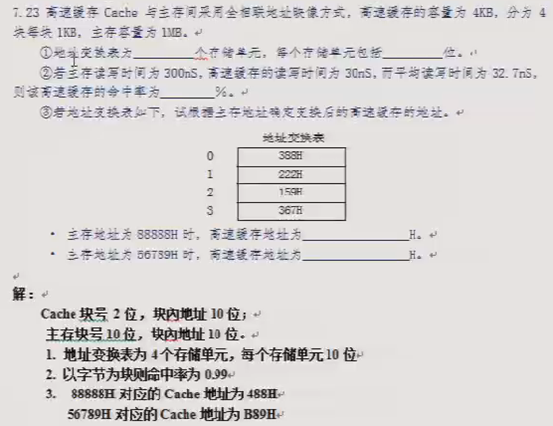

### 7.24

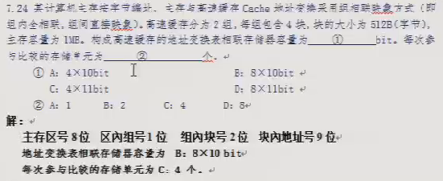

### 7.27

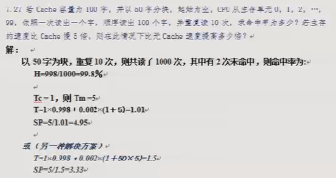

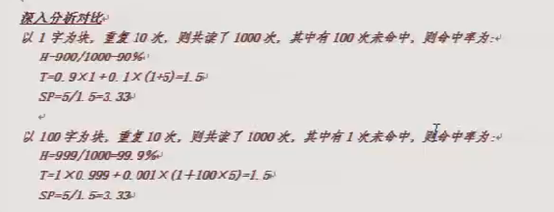

## 第八章

### 8.3-8.22

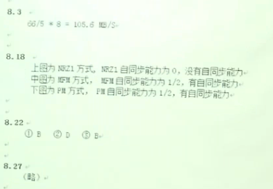

### 8.7 

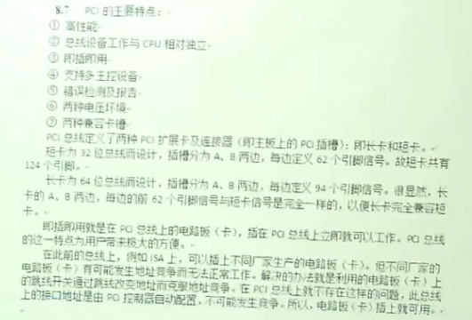

### 8.10

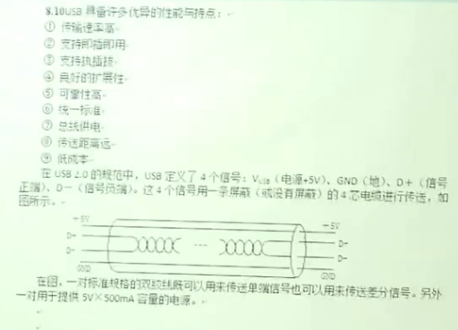

### 8.27

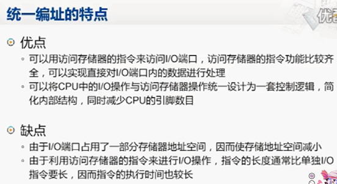

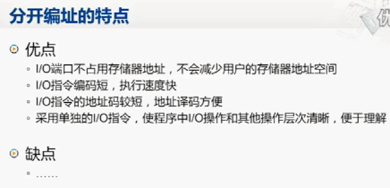

### 8.30

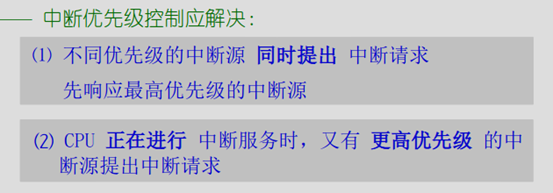

### 8.31

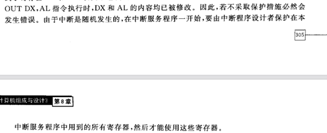

### 8.33

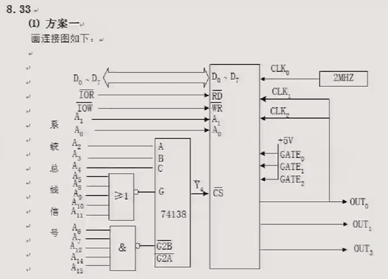

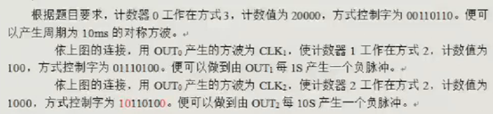

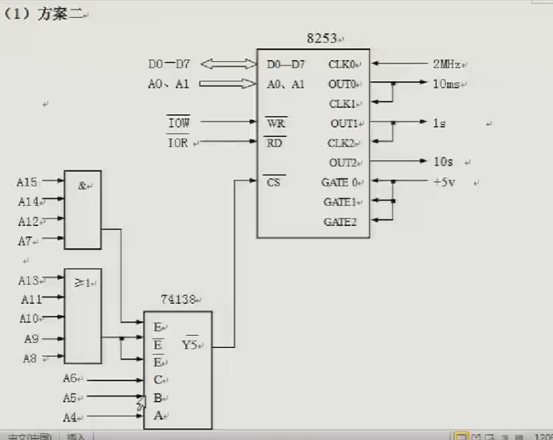

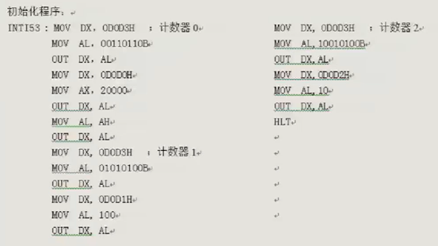

### 8.34

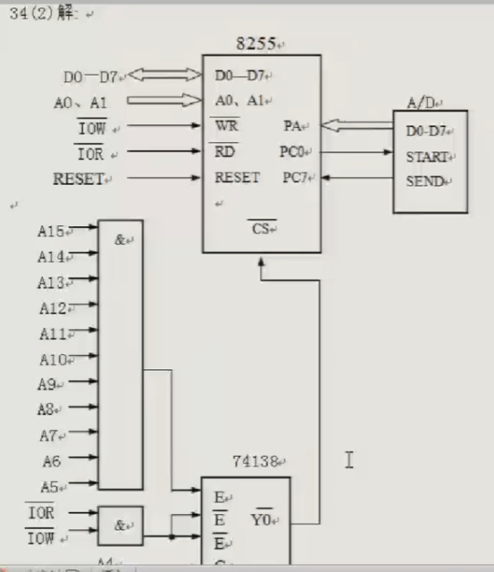

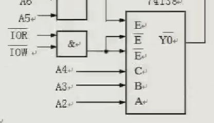

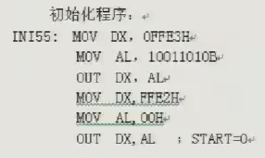

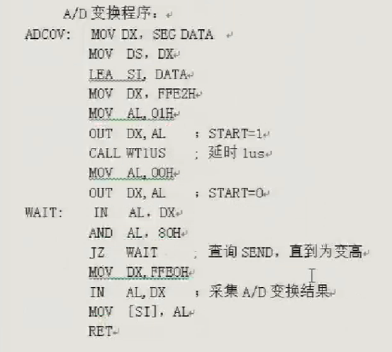